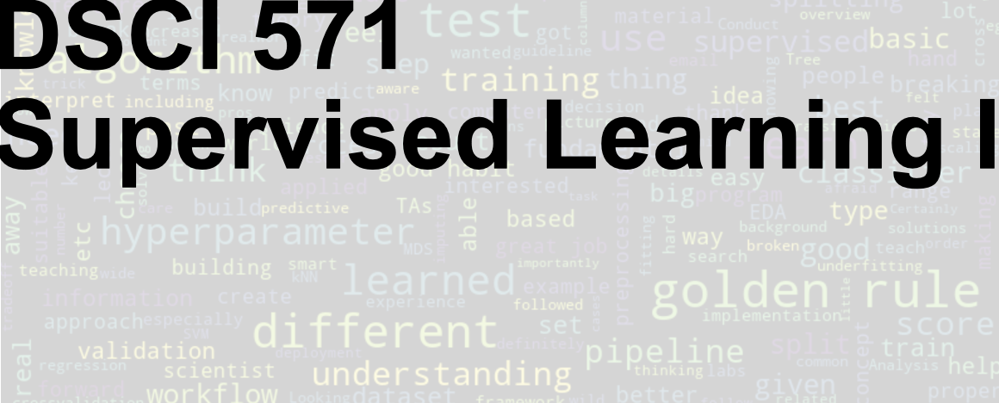

# Preface {.unnumbered}

{fig-alt="DSCI 571: Supervised Learning I" width="100%"}

This book accompanies DSCI 571: Supervised Learning I, an eight-lecture course in the Master of Data Science program at the University of British Columbia. It is adapted from materials developed for CPSC 330: Applied Machine Learning, with a focus on the foundations of supervised learning.

In supervised learning, we use examples with known outcomes to learn how to predict outcomes for new cases. Predicting a home's sale price from its characteristics and identifying spam from the contents of a message are two examples. Fitting a model is only part of the work: we also need to decide what information it should use and how to assess whether its predictions will be useful on new data.

The emphasis throughout is on building intuition, using machine learning tools effectively, and developing good practices for model selection and evaluation. The examples primarily use Python and the `scikit-learn` ecosystem.

## Who this book is for {.unnumbered}

The primary audience is Master of Data Science students with programming experience who are encountering machine learning for the first time. The book does not assume prior knowledge of machine learning or a strong mathematics background. When mathematical ideas are useful, we introduce them through intuition and concrete examples before adding technical detail.

You should be comfortable reading and writing short Python programs and working with common data structures such as lists, dictionaries, and arrays. Familiarity with NumPy arrays and pandas DataFrames is helpful for following the examples. We introduce the machine learning tools as they are needed.

## The goal of this book {.unnumbered}

Our goal is to help you build and evaluate a supervised learning workflow and explain the choices you make along the way. After working through this book, given a prediction problem, you should be able to:

1. **Frame the problem:** identify what to predict, what information is available, and whether machine learning is an appropriate approach.
2. **Choose the ingredients:** select suitable data representations, preprocessing steps, and supervised learning methods.
3. **Build and evaluate a prototype:** combine these components into a working solution and assess its performance on unseen data.
4. **Recognize limitations:** identify common workflow mistakes and explain what model predictions and evaluation results can—and cannot—tell us.
5. **Communicate responsibly:** explain your choices, results, and limitations clearly enough for others to assess the work.

These broad goals are developed through the [detailed learning objectives](learning-objectives.qmd).

## How to use this book {.unnumbered}

The chapters build on one another. Begin by working through Chapter 0 on your own before the first lecture; this introduction provides context for the eight lectures. The subsequent chapters begin with simple baselines and decision trees, then ask how to evaluate a model on data it has not seen. From there, we introduce distance-based models, preprocessing, pipelines, and text features. Chapter 6 covers hyperparameter optimization, and Chapter 7 introduces linear models for regression and classification. Chapter 8 takes a closer look at loss functions, extends logistic regression to multiple classes, and brings the course workflow together.

Read the explanations alongside the code, and pause to predict what an example will do before running it. Use the exercises to practise interpreting model behaviour and spotting problems in a workflow. A useful question to keep asking is: would this procedure still give us a trustworthy assessment on new data?

Students taking DSCI 571 should follow the schedule and assessment instructions for their course offering. The book serves as a reference for the core material and can also be used independently. It focuses on foundational supervised learning workflows; the broader range of machine learning methods and applications covered in the original CPSC 330 materials is beyond its scope.

## Acknowledgments {.unnumbered}

These notes have evolved over multiple offerings of CPSC 330 and have benefited from the contributions and feedback of instructors, teaching assistants, and students.

The original course notes were developed by Mike Gelbart, who taught the first two offerings of CPSC 330. Varada Kolhatkar subsequently expanded and substantially revised the notes, added examples, and created accompanying videos.

Over the years, several instructors (Giulia Toti, Firas Moosvi, Mehrdad Oveisi, and Mathias Lécuyer), teaching assistants, and students have contributed to the course materials and provided valuable feedback that has helped improve these notes. Thank you all! 

## License {.unnumbered}

### Instructional Material

All instructional material in this book and the corresponding repository is made available under the **Attribution 4.0 International** ([CC BY 4.0](https://creativecommons.org/licenses/by/4.0/)). 

This is a human-readable summary of (and not a substitute for) the [license](https://creativecommons.org/licenses/by/4.0/legalcode).

You are free:

* to **Share**---copy and redistribute the material in any medium or format
* to **Adapt**---remix, transform, and build upon the material

for any purpose, even commercially.

The licensor cannot revoke these freedoms as long as you follow the
license terms.

Under the following terms:

* **Attribution**---You must give appropriate credit (mentioning that
  your work is derived from work that is Copyright © Varada Kolhatkar, Mike  Gelbart, Giulia Toti, and Firas Moosvi, where practical, linking to https://github.com/UBC-CS/cpsc330-2024W1), provide a [link to the
  license][cc-by-human], and indicate if changes were made. You may do
  so in any reasonable manner, but not in any way that suggests the
  licensor endorses you or your use.

**No additional restrictions**---You may not apply legal terms or
technological measures that legally restrict others from doing
anything the license permits.  With the understanding that:

Notices:

* You do not have to comply with the license for elements of the
  material in the public domain or where your use is permitted by an
  applicable exception or limitation.
* No warranties are given. The license may not give you all of the
  permissions necessary for your intended use. For example, other
  rights such as publicity, privacy, or moral rights may limit how you
  use the material.

### Software

Except where otherwise noted, the example programs and other software
provided in this book and the corresponding repository are made available under the
MIT license.

MIT License

Copyright (c) 2024 Varada Kolhatkar and Mike Gelbart

Permission is hereby granted, free of charge, to any person obtaining a copy
of this software and associated documentation files (the "Software"), to deal
in the Software without restriction, including without limitation the rights
to use, copy, modify, merge, publish, distribute, sublicense, and/or sell
copies of the Software, and to permit persons to whom the Software is
furnished to do so, subject to the following conditions:

The above copyright notice and this permission notice shall be included in all
copies or substantial portions of the Software.

THE SOFTWARE IS PROVIDED "AS IS", WITHOUT WARRANTY OF ANY KIND, EXPRESS OR
IMPLIED, INCLUDING BUT NOT LIMITED TO THE WARRANTIES OF MERCHANTABILITY,
FITNESS FOR A PARTICULAR PURPOSE AND NONINFRINGEMENT. IN NO EVENT SHALL THE
AUTHORS OR COPYRIGHT HOLDERS BE LIABLE FOR ANY CLAIM, DAMAGES OR OTHER
LIABILITY, WHETHER IN AN ACTION OF CONTRACT, TORT OR OTHERWISE, ARISING FROM,
OUT OF OR IN CONNECTION WITH THE SOFTWARE OR THE USE OR OTHER DEALINGS IN THE
SOFTWARE.
